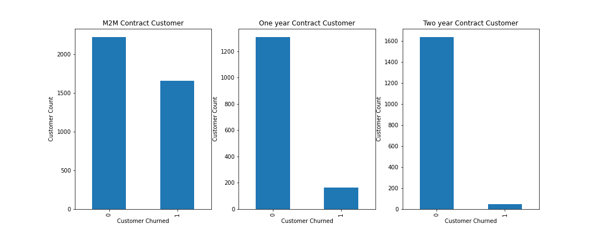
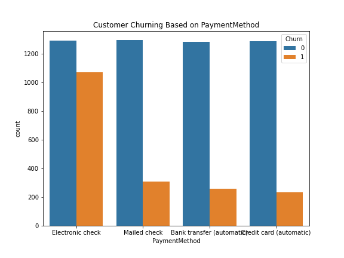

# Objective
For Telco companies it is key to attract new customers and at the same time avoid contract terminations (churn) to grow their revenue generating base. Looking at churn, different reasons trigger customers to terminate their contracts, for example better offers, more interesting packages, bad service experiences or change of customers’ personal situations.
Customer_Churn analysis provides valuable capabilities to predict customer churn and also define the underlying reasons that drive it. 
# Dataset
The data set for this classification problem is taken from Kaggle data set collection (https://www.kaggle.com/blastchar/telco-customer-churn). The analysis is started with imports of some basic libraries that are needed throughout the case. This includes Pandas and Numpy for data handling and processing as well as Matplotlib and Seaborn for visualization.

Name : Telco-Customer-Churn.csv

Number of variables : 21

Number of observations : 7043

Missing Cells : 11
# Data Dictionary
# Variable types
Categorical : 13

Boolean : 5

Numeric : 3
# Variables
    *	customerID          : Customer ID
    *	gender              : Whether the customer is a male or a female
    *	SeniorCitizen       : Whether the customer is a senior citizen or not (1, 0)
    *	Partner		        : Whether the customer has a partner or not (Yes, No)
    *	Dependents	        : Whether the customer has dependents or not (Yes,No)
    *	Tenure              : Number of months the customer has stayed with the company
    *	PhoneService	     : Whether the customer has a phone service or not (Yes, No)
    *	MultipleLines	     : Whether the customer has multiple lines or not (Yes, No, No phone service)
    *	InternetService     : Customer’s internet service provider (DSL, Fiber optic, No)
    *	OnlineSecurity      : Whether the customer has online security or not (Yes, No, No internet service)
    *	OnlineBackup        : Whether the customer has online backup or not (Yes, No, No internet service)
    *	DeviceProtection    : Whether the customer has device protection or not (Yes, No, No internet service)
    *	TechSupport         : Whether the customer has tech support or not (Yes, No, No internet service)
    *	StreamingTV         : Whether the customer has streaming TV or not (Yes, No, No internet service)
    *	StreamingMovies     : Whether the customer has streaming movies or not (Yes, No, No internet service)
    *	Contract            : The contract term of the customer (Month-to-month, One year, Two year)
    *	PaperlessBilling    : Whether the customer has paperless billing or not (Yes, No)
    *	PaymentMethodThe    : customer’s payment method (Electronic check, Mailed check, Bank transfer (automatic), Credit card (automatic))
    *	MonthlyCharges      : The amount charged to the customer monthly
    *	TotalCharges        : The total amount charged to the customer
    *	Churn		           : Whether the customer churned or not (Yes or No)

# Dataset Cleaning
   The dataset contains 7043 observation and from this the customerID is not need so i just drop the variable customerID
   telecom_cust.drop("customerID",axis=1,inplace=True)
# Missing Values
   From the 7043 observations only one varaible contains the missing values,ie.TotalCharges(11), Compared to the datset its very low so it is romeved from the set
   Removing missing values
   telecom_cust.dropna(inplace = True)

# Conclusion
   From the EDA there are some services and packages are the reason for churning customers,they are
 * From the tenure based analysis,from the total customers only a few customers are churning(they are works with the company for a long time)
   and the only the customers churning are is shorterm customers.
   
   
   
   from the graph we can see that only the customeres are churning the types of short term customers.
 * From the Internet service based analysis there is 78% customers using the service.
   
   
   
      from the customer using internet service ,there is two types of service that company provide OFC and DSL from analysis we know that 78% are using the internet service and 
      there is almost 72% of customers are churned from the OFC based internet connection. That shows, there is containg some problem in Optical Fiber Cable or its service.
 * On contarct based analysis,The company provide three types of Contract month to month, Two year, One year.From the analysis there is 55% of customers are type of 
   onth to month contract, 24% are the type of Two Year contract and remaining are (21%) of One year contarct.
  
   
      
      From the graph, the number of customers churned is high for month to month(M2M)contract.Above the 50% of customers are 
      M2M contract.

 * On PaymentMethod based analysis, only the Electronic check payment methods churning rate is high.
   
   
   
    The graphs shows that the rate of churning is high for electronic Check type,50% and above customers are churned.
    
 * From the overall analysis,there is the variables tenure,MonthlyCharges,TotalCharges are correlated with them.
   
      
   

      * Churning customers have much lower tenure 

      * Churning customers have higher monthly charges.

      * TotalCharges are the result of tenure and MonthlyCharges, which are more insightful on an individual basis.
    
   
